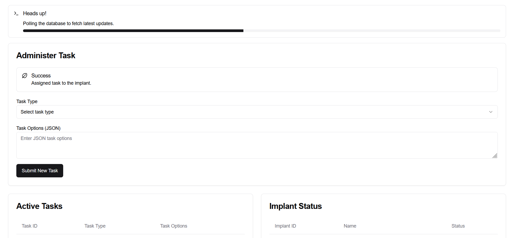
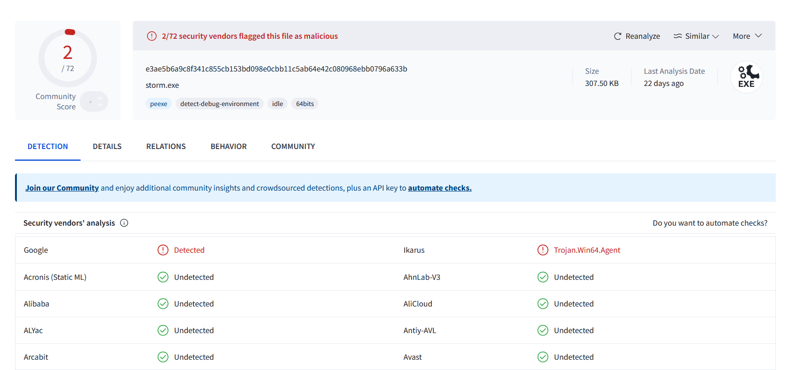
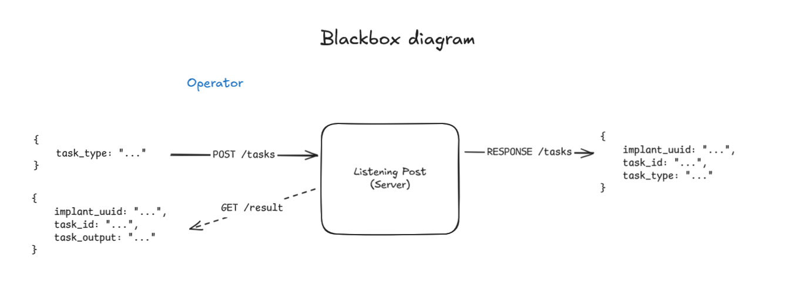
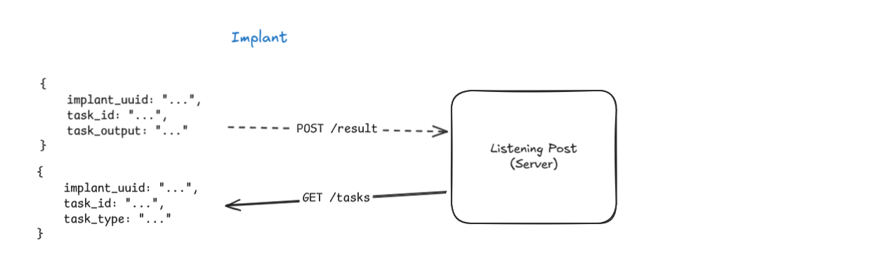
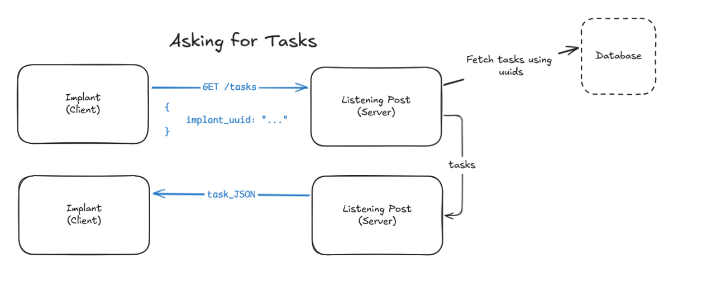
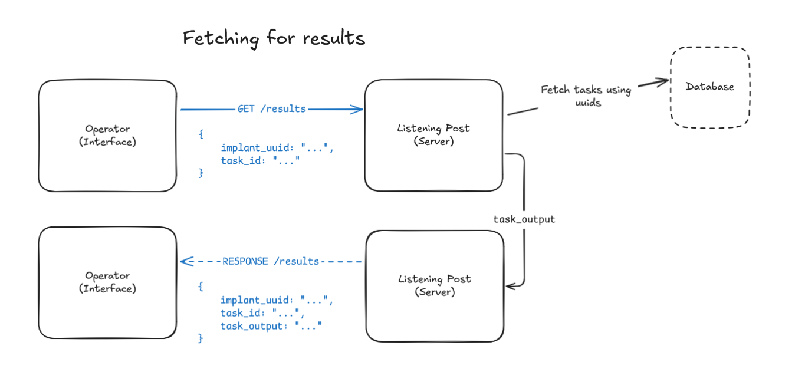

# RainC2
| Simple C2 (Command-and-control) setup that consists of an `implant`, a `listening-post` and an `operator control panel`. |

- Implant - Written in `C++`
- Listening Post - Built with `Nest.js (Javascript/Typescript)`
- Operator Control Panel - Built with `Next.js (Javascript/Typescript)`

## Screenshot/s

## Infrastructure Diagrams

